 

 

  

 

## `> whoami`

Software engineer who builds real-time AI systems, retrieval pipelines, and distributed backends. Previously the founding engineer at a voice AI startup where I owned the full stack, from RAG pipeline design to production AWS infrastructure. I talk to users before writing code, profile before optimizing, and ship before perfecting.

 

## `> cat projects.md`

<table>
<tr>
<td width="50%" valign="top">

### 🎙️ [Novum AI](https://novumai.co/)
**Founding Engineer** · Voice AI Startup

Built the entire backend for a platform that delivers real-time contextual suggestions to sales reps during live calls.

**Highlights:**
- 📉 Suggestion latency: **3.4s → under 1.5s** (62% faster)
- 🎯 Fact recall: **60-70% → 80-90%** via RAG redesign
- 💰 Prompt tokens: **4,900 → 1,950** (72% reduction)
- 🔧 Cross-encoder self-hosted at **$0.001/call** vs Cohere $0.028 (28x cheaper)

`Python` `FastAPI` `AWS Lambda` `Pinecone` `Redis` `WebSockets` `React`

</td>
<td width="50%" valign="top">

### 🛒 [Stoca](https://github.com/khamseaffan/stoca)
**Solo Developer** · AI-Native Local Commerce

The AI store manager that replaces an entire team. Store owners go online in 5 minutes and manage everything through conversation.

**Highlights:**
- 🤖 Claude streaming chat with **16 AI tools** for pricing, inventory, orders, promotions
- 🔍 Semantic search + pgvector for catalog enrichment
- 🐍 Python/FastAPI AI service for vision and search
- 📊 PostHog analytics + Supabase Realtime for live order tracking

`Next.js 16` `TypeScript` `Claude AI` `Prisma 7` `Supabase` `FastAPI` `pgvector`

</td>
</tr>
<tr>
<td width="50%" valign="top">

### ⚡ [FlashBids](https://github.com/arsalananwar11/Live-Flash-Auctioning-System)
**Lead Developer** · Real-Time Auction Platform

Anti-sniping engine with automatic time extensions during live bidding.

**Highlights:**
- 📊 p95 latency: **800ms → 200ms** (75% drop)
- 🔌 Found Redis connection bottleneck via profiling (50-80ms per new connection)
- 🚀 Designed for **1,000+ concurrent users** with Auto Scaling

`Flask` `Redis` `WebSockets` `AWS EC2` `DynamoDB` `CloudWatch`

</td>
<td width="50%" valign="top">

### 🔍 InquisAI
**Technical Lead** · AI Document Q&A

AI assistant for natural-language questions against large document collections. Never launched - taught me that feature creep kills products.

**Highlights:**
- ⚡ Migrated Flask → FastAPI: **30% latency reduction**
- 📋 Led Agile dev in 3-person team on Azure DevOps
- 📚 This failure directly shaped feature discipline at Novum AI

`FastAPI` `LangChain` `OpenAI` `ChromaDB` `AWS`

</td>
</tr>
</table>

 

## `> tech --stack`

### Languages

### Backend & Frameworks

### Cloud & Infrastructure

### AI & Data

 

## `> stats --github`

  
  

  

 

 

## `> echo "Let's connect"`

Always open to discussing distributed systems, retrieval pipelines, or anime (One Piece, Bleach, One Punch Man).

